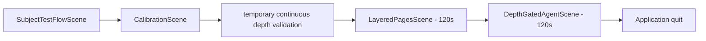

# Function Architecture

Project Gaze is split into four runtime areas:

1. Hardware bridges: ThinkVision display and 7Invensun A8 SDK access.
2. Calibration/adaptation: xy calibration, depth calibration, persisted artifacts, and input-mode selection.
3. Interaction core: gaze samples, blink confirmation, ray projection, target matching, and visual state resolution.
4. Task scenes: layered pages, AI logo panel, subject-test flow, and experiment logging.

## Scene Boundaries

| Scene | Bootstrap/controller | Responsibility |
| --- | --- | --- |
| `SubjectTestFlowScene` | `SubjectTestFlowController` | Runs the full subject sequence and timed scene transitions. |
| `CalibrationScene` | `CalibrationSceneBootstrap` | Owns calibration only; it does not automatically wrap task scenes. |
| `LayeredPagesScene` | `LayeredPagesBootstrap` | Standalone layered-page task scene. |
| `DepthGatedAgentScene` | `DepthGatedAgentBootstrap` | Standalone depth-gated AI panel task scene. |

`CalibrationSceneFlow` now only stores an explicit requested scene after calibration. Task scenes do not call an automatic "redirect to calibration" gate.
Task-scene bootstrap classes only attach the scene component; `LayeredPagesDemo`
and `DepthGatedAgentDemo` own page construction and confirmed-interaction
business behavior.

## Runtime Flow

Direct scene opening is supported. If stereo hardware and accepted calibration artifacts are unavailable, task scenes use mouse fallback.

## Main Code Areas

| Area | Representative files |
| --- | --- |
| ThinkVision bridge | `Assets/Scripts/Runtime/ThinkVision` |
| 7Invensun runtime | `Assets/Scripts/Runtime/InvensunA8` |
| Calibration | `Assets/Scripts/Runtime/Calibration` |
| Gaze interaction | `Assets/Scripts/Runtime/Gaze/Common` |
| Depth model and logs | `Assets/Scripts/Runtime/Gaze/Depth` |
| Spatial pages | `Assets/Scripts/Runtime/Gaze/SpatialPage` |
| Task scenes | `Assets/Scripts/Runtime/LayeredPages` |
| Subject flow | `Assets/Scripts/Runtime/SubjectTestFlow` |

## Input Modes

- Stereo gaze mode: 7Invensun A8 gaze + blink confirmation.
- Mouse fallback: cursor hover previews targets, left click confirms, scroll cycles overlapping depth hits.
- Space key: marks the latest/current task interaction as failed for experiment feedback.
- `R` / `S` are calibration-scene-only controls for recalibration or requested-scene skip/fallback.

Number-key depth controls and diagnostics hotkeys are intentionally removed from runtime interaction.

## Logging

Two logging families are maintained:

- `runtime-depth-layer-{sceneId}`: per-sample depth/layer matching diagnostics, with separate latest files per formal task scene.
- `task-interactions`: task-level success/failure records, including Space-key user feedback.

Both are saved to `ExperimentData/` and ignored by git. Experiment data capture is enabled by default and controls continuous depth validation logs, runtime depth-layer logs, and task-interaction logs together. For `SubjectTestFlowScene`, use the `SubjectTestFlowController` Inspector field `Data Capture Mode` to follow `PROJECT_GAZE_EXPERIMENT_DATA`, force logging on, or force logging off for that run. When the component follows the environment/default mode, set `PROJECT_GAZE_EXPERIMENT_DATA=0` before Unity starts to disable capture.
