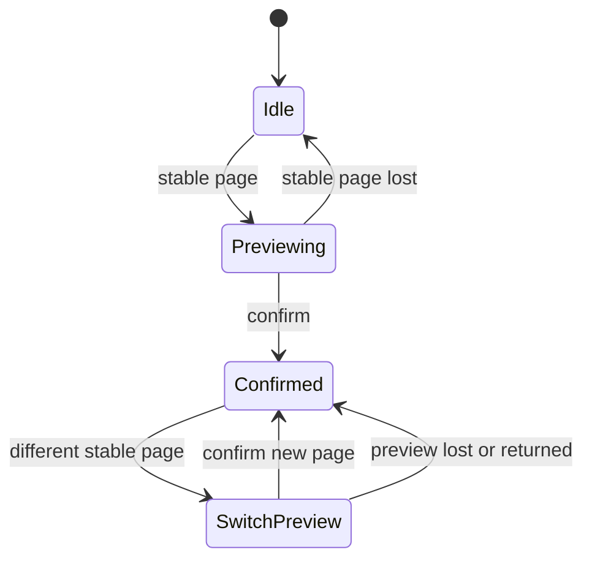

# Interaction State Machine Layer

The interaction layer converts noisy gaze and blink data into stable page interaction.

Main folders:

- `Assets/Scripts/Runtime/Gaze/Common`
- `Assets/Scripts/Runtime/Gaze/SpatialPage`
- `Assets/Scripts/Runtime/LayeredPages`

## Providers

`GazeInteractionController` depends on:

- `IGazeTrackingProvider`
- `IBlinkDetectionProvider`

Formal hardware mode uses:

- `InvensunA8GazeTrackingProvider`
- `InvensunA8BlinkDetectionProvider`

Fallback mode uses:

- `MouseCursorGazeTrackingProvider`
- `MouseClickConfirmProvider`

## Stable Hit Processing

`GazeInteractionController` performs dwell and hysteresis before handing a page id to the state machine:

- `PreviewDwellSeconds`
- `LeaveHysteresisSeconds`
- `SwitchCooldownSeconds`
- `BlinkConfirmCooldownSeconds`

This keeps short gaze jitter from causing immediate page selection.

## State Machine

`GazeInteractionStateMachine` is a pure C# state machine:

The visual layer maps snapshots to:

- dormant
- preview
- confirmed
- suppressed

## Target Matching

`GazeRayProjector` combines several strategies:

- viewport hit
- continuous predicted world point hit
- discrete depth layer matching
- mouse fallback depth cycling

`TargetMatcherPipeline` keeps these strategies composable and records which strategy produced a hit.

## Task Feedback

`GazeTaskInteractionRecorder` records task-level interactions. Events default to success. Pressing Space marks the latest completed interaction, or the current pending AI round trip, as failed.

This feedback does not change interaction behavior; it only updates experiment logs.
Task-scene code uses `GazeTaskInteractionSceneLogger` so task event construction, Space-key feedback, and persistence stay outside individual scene controllers. In the full subject-test flow, `SubjectTestFlowController.Data Capture Mode` can disable task-interaction logging from the Unity Inspector; its default mode follows `PROJECT_GAZE_EXPERIMENT_DATA`, where `0` disables capture before Unity starts.

## Keyboard and Mouse Shortcuts

Project-defined keyboard and mouse controls are intentionally minimal:

| Input | Scope | Effect |
| --- | --- | --- |
| `R` | `CalibrationScene` review/error state | Restart calibration from the xy stage. |
| `S` | `CalibrationScene` review/error state with a requested scene | Skip calibration and continue the requested task scene with mouse fallback. |
| `Space` | `LayeredPagesScene`, `DepthGatedAgentScene` | Mark the latest completed task interaction, or the current pending AI round trip, as failed in `task-interactions` logs. |
| Mouse hover | Task scenes in mouse fallback mode | Preview the page under the cursor. |
| Left mouse button | Task scenes in mouse fallback mode | Confirm the currently previewed page, equivalent to blink confirmation in stereo gaze mode. |
| Mouse wheel | Task scenes in mouse fallback mode | Cycle through overlapping depth candidates under the cursor. |

The project no longer defines number-key depth controls or `F5`--`F9` diagnostic hotkeys. OS-level shortcuts such as `Alt+F4` are not handled by project code.
